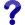

# Keyword Design

The following keywords will be the final keywords for the first release for this library. The keywords are broken down
into the following categories.

*Note Italics indicates optional*

## Display Keywords

| Keyword                             | Attributes                         | Default | Return Value | DescriptionUsage                                                  | Implemented                                       |
| ----------------------------------- | ---------------------------------- | ------- | ------------ | ----------------------------------------------------------------- |---------------------------------------------------|
| Set Primary Display Reference       | referenceName                      |         |              | Sets a Reference name for a display                               |               |
| Set Display By Id                   | displayId                          |         |              |                                                                   |               |
| Set Display Reference               | referenceName, inRelationTo        |         |              | Sets a Reference based on an existing reference display           |               |
| Set Monitored Display               | referenceName                      |         |              | Sets the Display being monitors                                   |               |
| Set Monitored Area                  | x,y,width,height                   |         |              | Sets the monitored area for the selected display                  |               |
| Reset Monitored Area                |                                    |         |              | Resets the monitored area to the original display size            |               |
| Reset Monitored Area For Display Id | displayId                          |         |              |                                                                   |               |
| Set Monitored Area For Display      | referenceName, x, y, width, height |         |              | Sets the monitored area for a given display reference             |               |
| Reset Monitored Area For Display    | referenceName                      |         |              | Resets the given monitored display area for the specified monitor |               |

## Settings Keywords 

| Keyword                   | Attributes           | Default | Return Value | Description                                      | Implemented                           |
| ------------------------- | -------------------- | ------- | ------------ | ------------------------------------------------ |---------------------------------------|
| Set Timeout Time          | waitTime             |         |              | How long a match will try to find an image.      |   |
| Set Poll Rate             | pollrate             |         |              |                                                  |   |
| Get Image Paths           |                      |         | List[String] |                                                  |   |
| Set Result Path           | path                 |         |              | The location for the image results/              |   |
| Set Match Percentage      | matchPercentage      |         |              | The percentage the image must match as a minimum |   |
| Add Image Location        | path                 |         |              | Adds a path to search for images.                |   |
| Set Command Delay Speed   | delayTime            |         |              | Delay Time after each command                    |         |
| Set Keystroke Speed       | timeBetweenKeystroke | 20ms    |              | Time between keystrokes                          |   |
| Set OCR Segmentation Mode | mode                 |         |              | Sets the OCR Segmentation Mode                   |         |
| Set OCR Language          | language             |         |              | Sets the language for OCR                        |         |
| Set OCR Engine            | engine               |         |              | Sets the OCR Engine                              |         |

## Window Keywords

| Keyword                   | Attributes                | Default | Return Value                 | Description                                  | Implemented                          |
| ------------------------- | ------------------------- | ------- |------------------------------| -------------------------------------------- |--------------------------------------|
| Get All Available Windows |                           |         | Array[windowName]            |                                              |  |
| Get Window Dimensions     | windowName                |         | Dictionary(x,y,width,height) | returns the dimensions of a window.          |  |
| Bring Window To Front     | windowName                |         | N/A                          | Bring the window to the front of visibility. |  |
| Send Window To Back       | windowName                |         | N/A                          | Sends the window behind all other windows.   |        |
| Resize Window             | windowName, width, height |         |                              | Resizes the window to the given dimensions.  |  |
| Move Window               | windowName, x, y          |         |                              | Moves the window to the given coordinates.   |  |

## Image Match Keywords

| Keyword                                | Attributes                                                           | Default | Return       | Description                                             | Implemented                          |
| -------------------------------------- | -------------------------------------------------------------------- | ------- | ------------ | ------------------------------------------------------- |--------------------------------------|
| Verify Image Exists                    | imageName,*minMatchScore*, *waitTime*                                |         | actualScore  | Finds an Image in a the defined display area.           |  |
| Verify Image Exists On Display         | imageName, referenceName,*minMatchScore, waitTime*                   |         | actualScore  | Searches a specific display for the image defined       |  |
| Verify Image Exits On Window           | imageName, windowName,*minMatchScore, waitTime*                      |         | actualScore  | Searches a specific form for the defined image.         |        |
| Verify Image Does Not Exist            | imageName,*minMatchScore*, *waitTime*                                |         | closestMatch | Verifies a image is not visible on the default display. |        |
| Verify Image Does Not Exist On Display | imageName, referenceName,*minMatchScore, waitTime*                   |         | closestMatch |                                                         |        |
| Verify Image Does Not Exist On Window  | imageName, windowName,*minMatchScore, waitTime*                      |         | closestMatch |                                                         |        |
| Get Image Bounds                       | imageName                                                            |         | Dictionary   | Returns the bounds of the image on the default display. |        |
| Get Image Bounds On Display            | imageName, referenceName                                             |         | Dictionary   |                                                         |        |
| Get Image bounds On Window             | imageName, windowName                                                |         | Dictionary   |                                                         |        |
| Move Mouse To Image                    | imageName                                                            |         |              |                                                         |        |
| Click Image                            | imageName                                                            |         |              |                                                         |        |
| Click Image On Display                 | imageName, referenceName                                             |         |              |                                                         |        |
| Click Image On Window                  | imageName, windowName                                                |         |              |                                                         |        |
| Drag Image To Image                    | sourceImage, targetImage                                             |         |              |                                                         |        |
| Drag Image To Relative Location        | sourceImage, x, y                                                    |         |              |                                                         |        |
| Drag Image To Fixed                    | sourceImage, x, y                                                    |         |              |                                                         |        |
| Drag Image From Display To Display     | sourceImage, sourceDisplay,x1,y1, targetImage, targetDisplay, x2, y2 |         |              |                                                         |        |

## Text Recognition

| Keyword                       | Attributes             | Returns                                    | Description             | Implemented                     |
| ----------------------------- | ---------------------- | ------------------------------------------ | ----------------------- |---------------------------------|
| Get Text                      |                        | All Interpreted Text                       | All Text on set display |   |
| Get Text on Display           | displayReference       | All Interprested Test in Display Reference |                         |   |
| Get Text on Window            | windowName             | All Interpreted Text in Window             |                         |   |
| Verify Text Exists            | text                   |                                            | Regex Matching enabled  |   |
| Verify Text Exists On Display | text, displayReference |                                            | Regex Matching enabled  |   |
| Verify Text Exists On Window  | text, windowName       |                                            | Regex Matching enabled  |   |
| Verify Text In Image          | text, imageName        |                                            | Regex Matching enabled  |   |
| Click Text                    | text                   |                                            | Regex Matching enabled  |   |
| Click Text On Display         | text, displayReference |                                            | Regex Matching enabled  |   |
| Click Text On Window          | text, windowName       |                                            | Regex Matching enabled  |   |
| Click Text In Image           | text, imageName        |                                            | Regex Matching enabled  |   |
| Move Mouse To Text            | text                   |                                            | Regex Matching enabled  |   |
| Get Text Bounds               | text                   | Dictionary                                 | Regex Matching enabled  |   |
| Get Text Bounds On Window     | text, windowName       | Dictionary                                 | Regex Matching enabled  |   |
| Get Text Bounds Matched Image | text, imageName        | Dictionary                                 | Regex Matching enabled  |   |

## Controls

| Keyword               | Attributes          | Default | Returns | Description | Implemented                               |
| --------------------- | ------------------- | ------- | ------- | ----------- |-------------------------------------------|
| Move Mouse To         | x, y                |         |         |             |       |
| Move Mouse To Display | referenceName, x, y |         |         |             |       |
| Move Mouse To Image   | imageName           |         |         |             |       |
| Move Mouse            | x,y                 |         |         |             |       |
| Click Location        | x,y                 |         |         |             |             |
| Type                  | text                |         |         |             |       |
| Copy Selected Test    |                     |         |         |             |             |
| Paste Selected Text   |                     |         |         |             |             |
| Get Selected Text     |                     |         | text    |             |             |
| Paste Text            | text                |         |         |             |             |
| Press Keys            | keys                |         |         |             |       |
| Hold Keys             | keys                |         |         |             |       |
| Release Keys          | keys                |         |         |             |       |
| Press Mouse Button    | button              |         |         |             |             |
| Release Mouse Button  | button              |         |         |             |             |
| Click Mouse Button    | button,_times_      |         |         |             |       |
| Mouse Scroll Up       | ticks               |         |         |             |             |
| Mouse Scroll Down     | ticks               |         |         |             |             |
